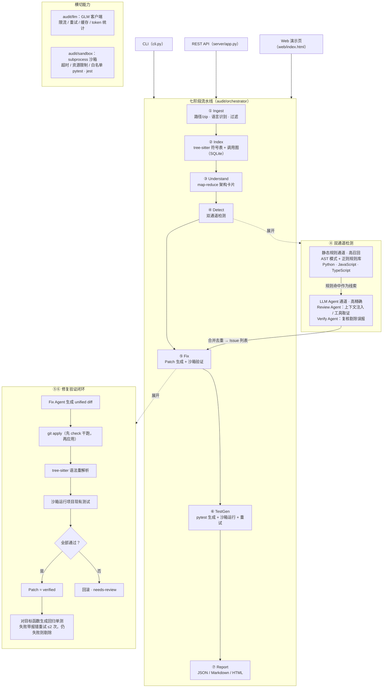

# CodeAudit Agent —— 代码库级智能审计与重构 Agent

[](https://github.com/mingkiiiiing/codeaudit-agent/actions/workflows/ci.yml)
[](pyproject.toml)
[](LICENSE)

输入一个项目目录（或 zip），自动完成「架构理解 → 问题检测 → 修复 Patch → 单元测试生成 → 审计报告」全流程。基座模型 GLM-5.3 Flash（OpenAI 兼容接口），未配置 API Key 时自动降级为纯静态规则的离线模式。

## 快速体验（离线，约 10 秒）

```bash
pip install -e ".[dev]"          # 或 make install
python demo/run_demo.py          # 或 make demo
```

不需要网络与 API Key。脚本对 `demo/mini_app`（内置一处 SQL 拼接注入缺陷的迷你靶项目）跑完整七阶段流水线：
检测命中 critical 问题 → 生成修复 diff 并经 `git apply` / 语法重解析 / 运行现有测试验证为 `verified`
→ 为修复后的函数生成回归单测并在沙箱中跑通（含注入载荷用例）→ 输出 JSON / Markdown / HTML 报告。
演示中只有 LLM 的"思考"由脚本化 FakeLLM 替代，验证与沙箱运行均真实执行；细节与预期输出见 [demo/README.md](demo/README.md)。

## 特性

- **双通道检测**：tree-sitter AST + 正则的静态规则通道负责高召回、零成本；LLM Agent 通道以规则命中为线索，注入符号表 / 调用链上下文并可主动调用 `find_references` 等工具跨文件取证，再经 Verify Agent 复核，负责高精确。覆盖 bug / performance / security / style 四类问题。
- **修复闭环**：对 critical / high 问题生成 unified diff，`git apply --check` 后在沙箱中重解析语法、运行项目现有测试，只有验证通过的 Patch 才标记 `verified`，其余回退 `needs-review`，不阻断流程。
- **单测生成**：对已验证 Patch 涉及的目标函数生成 pytest 用例，沙箱运行，失败带 traceback 重试（≤2 次），仍失败则剔除；生成文件只写入 `<src>/tests/generated/`，可整目录删除。
- **三端入口**：CLI（`run / index / report / serve`）、REST API（异步任务 + SSE 进度）、单文件 Web 演示页（任务创建、阶段进度、健康分仪表盘、问题过滤与详情、Patch diff 视图）。输出 JSON + Markdown + HTML 三种报告。
- **工程约束**：文件级并发、token 预算熔断、增量缓存；单阶段失败只记入报告不中断审计；支持 Python / JavaScript / TypeScript。

## 架构



横切能力：`audit/llm`（GLM 客户端；未配置 Key 时为 `FakeLLMClient`）与 `audit/sandbox`（白名单 pytest / jest 执行器）被 ③④⑤⑥ 共用；任一阶段失败只记入报告，不中断审计。

## 快速开始

### 安装

```bash
# Python >= 3.11（开发验证环境 3.13）
pip install -e ".[dev]"    # 或 make install
```

### 配置 GLM_API_KEY（可选）

```bash
cp .env.example .env                        # 三个变量带注释，按需填写后再 export
export GLM_API_KEY=sk-xxx                    # 智谱开放平台 API Key
export GLM_BASE_URL=https://open.bigmodel.cn/api/paas/v4   # 可选，默认值
export GLM_MODEL=glm-5.3-flash               # 可选，默认值
```

未设置 `GLM_API_KEY` 时流水线自动进入**纯规则离线模式**（进度事件提示"LLM 未配置，运行纯规则模式"），仅静态规则通道工作，不发起任何网络请求；也可用 `--no-llm` 显式强制。修复与单测生成依赖 LLM，离线模式下这两个阶段会被跳过并在报告中注明（想看离线闭环效果请跑 `python demo/run_demo.py`，见上文「快速体验」）。

### Makefile 常用任务

```bash
make install   # pip install -e ".[dev]"
make test      # python -m pytest tests -q
make lint      # ruff check .
make demo      # python demo/run_demo.py（离线全闭环演示）
make serve     # python cli.py serve（Web 服务模式）
```

### CLI

```bash
# 1. 完整审计（默认纯规则 + LLM 双通道；--fix / --tests 开启修复与单测闭环）
python cli.py run ./my-project --out ./reports
python cli.py run ./my-project --fix --tests --review-mode tools --fix-max 20 --testgen-max 10
python cli.py run ./my-project --no-llm --json          # 离线纯规则，JSON 输出到 stdout

# 2. 只做接入 + 索引（Stage 1~2），打印符号/调用图统计
python cli.py index ./my-project

# 3. 把已落盘的 report.json 转成 Markdown / HTML
python cli.py report ./reports/report.json --format md
python cli.py report ./reports/report.json --format html --out ./reports/report.html
```

`run` 主要参数：

| 参数 | 说明 |
|---|---|
| `--out DIR` / `--work-root DIR` | 报告输出目录 / 工作区根（默认 `.codeaudit/`） |
| `--lang python javascript ...` | 限定语言，默认自动检测 |
| `--fix` / `--tests` | 开启修复 Patch 生成 / 单测生成 |
| `--no-llm` | 禁用 LLM，纯规则模式 |
| `--review-mode simple\|tools` | LLM 审查模式：单次 JSON 调用 / 工具取证循环（默认 simple） |
| `--no-verify` | 关闭 Verify Agent 复核 |
| `--fix-max N` / `--testgen-max N` | 单次审计最多生成的 Patch 数 / 单测目标函数数（默认 50 / 30） |
| `--json` | 以 JSON 输出完整报告 |

### REST API 与 Web 演示页

```bash
python cli.py serve --host 127.0.0.1 --port 8000     # 浏览器打开 http://127.0.0.1:8000
```

```bash
# 创建任务（异步），返回 audit_id
curl -s -X POST http://127.0.0.1:8000/api/audits \
     -H "Content-Type: application/json" \
     -d '{"source_path": "D:/demo/my-project", "do_fix": true, "do_tests": false}'

# 任务状态（done 后附带完整报告）
curl -s http://127.0.0.1:8000/api/audits/<audit_id>

# SSE 进度流（回放历史事件并跟随，收尾发送 {"type":"done"}）
curl -N http://127.0.0.1:8000/api/audits/<audit_id>/events

# 报告下载：json | md | html
curl -s "http://127.0.0.1:8000/api/audits/<audit_id>/report?format=md"

# 仪表盘数据：摘要 / 分页问题列表（severity、category 过滤）/ Patch 列表
curl -s http://127.0.0.1:8000/api/audits/<audit_id>/summary
curl -s "http://127.0.0.1:8000/api/audits/<audit_id>/issues?severity=high&category=bug&limit=20&offset=0"
curl -s http://127.0.0.1:8000/api/audits/<audit_id>/patches
```

| 端点 | 说明 |
|---|---|
| `POST /api/audits` | 创建审计任务 `{source_path, do_fix, do_tests}` → `{audit_id}` |
| `GET /api/audits/{id}` | 状态 `queued/running/done/failed`，done 时含 `report` |
| `GET /api/audits/{id}/events` | SSE 进度事件流 |
| `GET /api/audits/{id}/report?format=json\|md\|html` | 报告 |
| `GET /api/audits/{id}/summary` | 健康分、严重度计数、耗时、token 统计 |
| `GET /api/audits/{id}/issues` | 分页问题列表；`severity` / `category` / `limit`（默认 50）/ `offset` |
| `GET /api/audits/{id}/patches` | Patch 列表（含 diff 原文与 `apply_status`） |

错误约定：任务不存在 → `404 {"detail": "任务不存在：<id>"}`；任务未完成时访问报告类端点 → `404 {"detail": "任务未完成：<status>"}`；参数非法 → `400`。

### 报告与健康分

健康分 `= max(0, 100 − 加权问题密度 × 50)`，权重 critical=10、high=5、medium=2、low=0.5，密度按每千行计算。报告包含：项目概览、健康分、按严重度分组的问题总表、critical/high 详情（描述 / 证据 / 建议 / 代码片段）、架构摘要、Patch 与测试统计、耗时与 token 统计。

## 指标

| 指标 | 口径（详见 docs/04） | 目标 | 实测 |
|---|---|---|---|
| 问题识别精确率 | critical + high 级别，对金标集（≥150 条）的 Precision | ≥ 85% | 见 `bench/results/`（含离线纯规则基线；LLM 相关指标待配置 Key 真跑） |
| 审计耗时 | 端到端耗时 / KLOC，≥10 个项目取 P50 / P90 | P50 < 30 s/KLOC | 见 `bench/results/` |
| 效率提升 | `(T_human − (T_agent + T_review)) / T_human` | ≥ 70% | 见 `bench/results/` |
| 成本 | tokens/KLOC（prompt / completion 分列） | — | 见 `bench/results/` |

以上为设计目标；实测数据由 `python -m bench.run --projects ... --goldset bench/datasets/goldset.jsonl --ablation` 产出（需配置 `GLM_API_KEY`），同时输出 7 组配置的消融表。未经过真跑的数字不作为已验证结果引用。

## 文档索引

| 文档 | 内容 |
|---|---|
| [00-项目总览](docs/00-项目总览.md) | 项目定位、一页纸项目卡、核心设计思想、目录规划 |
| [01-需求规格说明书](docs/01-需求规格说明书.md) | 功能需求 FR-1~FR-7、非功能需求、指标口径、范围边界 |
| [02-系统架构设计](docs/02-系统架构设计.md) | 七阶段流水线、双通道检测、模块职责、数据模型、并发与沙箱 |
| [03-Agent工具集与Prompt设计](docs/03-Agent工具集与Prompt设计.md) | 工具 JSON Schema、各 Agent 的 System Prompt |
| [04-评估与指标验证方案](docs/04-评估与指标验证方案.md) | Benchmark 构建、指标定义与公式、消融实验、结果记录模板 |
| [05-开发计划-风险-面试准备](docs/05-开发计划-风险-面试准备.md) | 里程碑、风险清单、高频问题 |
| [06-多任务并行开发计划](docs/06-多任务并行开发计划.md) | Wave 1 任务分解、契约与协作规约 |
| [07-Wave2总体方案与任务分解](docs/07-Wave2总体方案与任务分解.md) | Wave 2 目标、契约 v1.2、任务分解与真实指标实测流程 |
| [08-Wave3总体方案与GitHub发布](docs/08-Wave3总体方案与GitHub发布.md) | Wave 3 目标（金标扩充 / 消融开关 / 演示与发布 / CI）、契约 v1.3、GitHub 提交方案 |

## 目录结构

```
.
├── audit/                  # 核心包
│   ├── ingest/             # Stage 1 接入：路径/zip、语言识别、过滤
│   ├── indexer/            # Stage 2 索引：tree-sitter、符号表、调用图（SQLite）
│   ├── understand/         # Stage 3 理解：map-reduce 架构摘要
│   ├── detect/             # Stage 4 检测：engine + rules/（静态规则库）
│   ├── agents/             # Review / Verify Agent（LLM 通道）
│   ├── fix/                # Stage 5 修复：Patch 生成与沙箱验证
│   ├── testgen/            # Stage 6 单测生成
│   ├── report/             # Stage 7 报告：builder + Jinja2 模板（md/html）
│   ├── orchestrator/       # 七阶段编排、进度事件
│   ├── agent/              # Agent 运行时：工具循环、预算控制
│   ├── llm/                # GLM 客户端：限流、重试、缓存、token 统计；FakeLLMClient
│   ├── sandbox/            # subprocess 沙箱：超时、资源限制
│   ├── config.py           # AuditConfig（环境变量 + 覆盖）
│   └── models.py           # AuditReport / Issue / Patch / TestCase 等数据模型
├── server/app.py           # FastAPI：异步任务、SSE、报告与仪表盘 API
├── web/index.html          # 单文件演示前端（零依赖）
├── cli.py                  # 命令行入口：run / index / report / serve
├── bench/                  # Benchmark：金标构建、匹配、指标、消融、真跑脚本
├── demo/                   # 离线全闭环演示：run_demo.py + mini_app 靶项目（见 demo/README.md）
├── tests/                  # 单元测试（tests/unit/**）与样例工程（tests/samples/demo_proj）
├── docs/                   # 设计文档 00~08
├── Makefile                # install / test / lint / demo / serve
├── .env.example            # GLM_API_KEY / GLM_BASE_URL / GLM_MODEL 示例
└── LICENSE                 # MIT
```

## 测试

```bash
python -m pytest tests -q                                   # 全量（零网络、零真实 LLM）；或 make test
python -m pytest tests/unit/server tests/unit/cli -q        # 服务与 CLI
python -m pytest tests/unit/demo -q                         # 演示夹具一致性（diff 可 apply、生成单测过硬闸门、靶点唯一）
```

## License

[MIT](LICENSE) © 2026 mingkiiiiing
