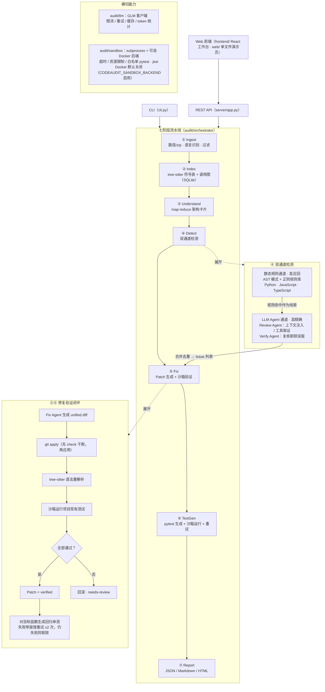

# CodeAudit Agent —— 代码库级智能审计与重构 Agent

[](https://github.com/mingkiiiiing/codeaudit-agent/actions/workflows/ci.yml)
[](https://github.com/mingkiiiiing/codeaudit-agent/releases)
[](https://mingkiiiiing.github.io/codeaudit-agent/)
[](pyproject.toml)
[](LICENSE)

输入一个项目目录（或 zip），自动完成「架构理解 → 问题检测 → 修复 Patch → 单元测试生成 → 审计报告」全流程。基座模型 GLM-5.3 Flash（OpenAI 兼容接口），未配置 API Key 时自动降级为纯静态规则的离线模式。

## 快速体验（离线，约 10 秒）

```bash
pip install -e ".[dev]"          # 或 make install
python demo/run_demo.py          # 或 make demo
```

不需要网络与 API Key。脚本对 `demo/mini_app`（内置一处 SQL 拼接注入缺陷的迷你靶项目）跑完整七阶段流水线：
检测命中 critical 问题 → 生成修复 diff 并经 `git apply` / 语法重解析 / 运行现有测试验证为 `verified`
→ 为修复后的函数生成回归单测并在沙箱中跑通（含注入载荷用例）→ 输出 JSON / Markdown / HTML 报告。
演示中只有 LLM 的"思考"由脚本化 FakeLLM 替代，验证与沙箱运行均真实执行；细节与预期输出见 [demo/README.md](demo/README.md)。

## 特性

- **双通道检测**：tree-sitter AST + 正则的静态规则通道负责高召回、零成本；LLM Agent 通道以规则命中为线索，注入符号表 / 调用链上下文并可主动调用 `find_references` 等工具跨文件取证，再经 Verify Agent 复核，负责高精确。覆盖 bug / performance / security / style 四类问题，内置静态规则库 **82 条**（Python 51 / JavaScript 24 / TypeScript 专属 7，含 JS/TS 共享 9），另有全库后处理扫描器：克隆检测（≥6 行滚动哈希）、死代码（私有符号零引用保守口径）、依赖 CVE 匹配（27 条经核实的真实 CVE 种子库，`CODEAUDIT_OSV_ONLINE=1` 可叠加 OSV 在线全量口径）、配置文件明文密钥扫描（.env/yaml/properties 等，自动打码）与冗余依赖检出（DEP-UNUSED）。
- **规则手册自动生成**（0.3.0）：规则注册表即文档——`python scripts/gen_rule_docs.py` 从注册表生成规则手册页（含每条规则的判定说明与统计），随[文档站](https://mingkiiiiing.github.io/codeaudit-agent/rules/)发布，规则与文档不再漂移。
- **修复闭环**：对 critical / high 问题生成 unified diff，`git apply --check` 后在沙箱中重解析语法、运行项目现有测试，只有验证通过的 Patch 才标记 `verified`，其余回退 `needs-review`，不阻断流程。0.4.0 起 **JavaScript / TypeScript 同样进入修复与单测验证闭环**（`node --check` 语法验证 + `node --test` 单测验证，node 不可用时诚实降级标注）。
- **单测生成**：对已验证 Patch 涉及的目标函数生成 pytest 用例，沙箱运行，失败带 traceback 重试（≤2 次），仍失败则剔除；生成文件只写入 `<src>/tests/generated/`，可整目录删除。
- **重构方案生成器**（0.4.0）：确定性启发式 + LLM 增强双层——确定性层零 LLM 可出（长函数分解、重复代码聚类、热点模块拆分、循环依赖提示，从已有索引与规则命中聚合），LLM 层深化每条方案的理由与步骤（未配置 Key 安全降级）；审计报告新增**「重构方案」章节**，逐条给出目标 / 类型 / 理由 / 落地步骤 / **优先级（P0/P1/P2）与估算工时**（0.7-W16）。
- **四端入口**（0.5.0）：CLI（`run / index / report / serve`）、REST API（异步任务 + SSE 进度 + 契约 v2：任务列表 / 删除 / zip 上传 / 重构方案 / 架构理解）、**React 审计工作台**（`frontend/`：仪表盘任务列表、zip 拖拽上传、七阶段 SSE 进度、健康分与严重度图表、问题过滤与详情、Patch diff、重构方案，构建产物由 `serve` 直接托管）、单文件 Web 演示页（零构建回退入口）。输出 JSON + Markdown + HTML 三种报告。
- **服务化与沙箱演进**（0.6.x）：**任务持久化**（SQLite 落库，服务重启后终态任务与报告仍可查询下载）、线程池执行与协作式取消、任务准入控制（并发上限，超出返回 429）、`serve --workers N` 多 worker（实验特性）；沙箱新增**可选 Docker 后端**（容器级隔离，默认关闭，`CODEAUDIT_SANDBOX_BACKEND` 启用，docker 不可用时诚实降级 subprocess）；**CI 在线评估工作流**（weekly 抽样 + 手动触发，GLM_API_KEY 缺失自动跳过）；前端预算熔断 / 降级可视化。
- **CI 集成**（0.2.0）：`--format sarif` 生成 SARIF 2.1.0 报告，可上传 GitHub Security tab；`--check --fail-on` 把审计结果变成 PR 硬门禁；`--diff` 增量审计 + 基线抑制，实现「存量豁免、增量把关」。
- **工程约束**：文件级并发、token 预算熔断、增量缓存；单阶段失败只记入报告不中断审计；支持 Python / JavaScript / TypeScript。

## 架构



横切能力：`audit/llm`（GLM 客户端；未配置 Key 时为 `FakeLLMClient`）与 `audit/sandbox`（白名单 pytest / jest 执行器，可选 Docker 后端，默认关闭）被 ③④⑤⑥ 共用；任一阶段失败只记入报告，不中断审计。

## 快速开始

### 安装

```bash
# Python >= 3.11（开发验证环境 3.13）
pip install -e ".[dev]"    # 或 make install
```

0.2.0 起 `pip install -e .` 后提供 `codeaudit` 命令（版本号单源，`python cli.py` 仍完全等价）：

```bash
pip install -e .           # 只装运行时依赖；开发环境另加 .[dev]
codeaudit --version        # 查看版本
codeaudit run ./my-project # 与 python cli.py run 等价
```

### 配置 GLM_API_KEY（可选）

```bash
cp .env.example .env                        # 变量模板（带注释），仅作留存；见下方说明
export GLM_API_KEY=sk-xxx                    # 智谱开放平台 API Key
export GLM_BASE_URL=https://open.bigmodel.cn/api/paas/v4   # 可选，默认值
export GLM_MODEL=glm-5.3-flash               # 可选，默认值
```

> **`.env` 自动加载（0.6/W12 起）**：`from_env` 会自动发现并加载当前工作目录的 `.env`（零依赖解析：支持 `#` 注释、`export ` 前缀、首尾引号；只认 GLM_/CODEAUDIT_ 白名单键；解析失败静默跳过）。**真实环境变量逐键优先于 `.env`**——已 `export` 的值不会被覆盖。因此拿到 Key 后 `cp .env.example .env` 填入即可直接使用，无需 export。注意：`.env` 已被 gitignore，绝不要提交。

未设置 `GLM_API_KEY` 时流水线自动进入**纯规则离线模式**（进度事件提示"LLM 未配置，运行纯规则模式"），仅静态规则通道工作，不发起任何网络请求；也可用 `--no-llm` 显式强制。修复与单测生成依赖 LLM，离线模式下这两个阶段会被跳过并在报告中注明（想看离线闭环效果请跑 `python demo/run_demo.py`，见上文「快速体验」）。

### Makefile 常用任务

```bash
make install   # pip install -e ".[dev]"
make test      # python -m pytest tests -q
make lint      # ruff check .
make demo      # python demo/run_demo.py（离线全闭环演示）
make serve     # python cli.py serve（Web 服务模式）
make web       # cd frontend && npm install && npm run build（审计工作台构建）
```

### CLI

```bash
# 1. 完整审计（默认纯规则 + LLM 双通道；--fix / --tests 开启修复与单测闭环）
python cli.py run ./my-project --out ./reports
python cli.py run ./my-project --fix --tests --review-mode tools --fix-max 20 --testgen-max 10
python cli.py run ./my-project --no-llm --json          # 离线纯规则，JSON 输出到 stdout

# 2. 只做接入 + 索引（Stage 1~2），打印符号/调用图统计
python cli.py index ./my-project

# 3. 把已落盘的 report.json 转成 Markdown / HTML
python cli.py report ./reports/report.json --format md
python cli.py report ./reports/report.json --format html --out ./reports/report.html
```

`run` 主要参数：

| 参数 | 说明 |
|---|---|
| `--out DIR` / `--work-root DIR` | 报告输出目录 / 工作区根（默认 `.codeaudit/`） |
| `--lang python javascript ...` | 限定语言，默认自动检测 |
| `--fix` / `--tests` | 开启修复 Patch 生成 / 单测生成 |
| `--no-llm` | 禁用 LLM，纯规则模式 |
| `--review-mode simple\|tools` | LLM 审查模式：单次 JSON 调用 / 工具取证循环（默认 simple） |
| `--no-verify` | 关闭 Verify Agent 复核 |
| `--fix-max N` / `--testgen-max N` | 单次审计最多生成的 Patch 数 / 单测目标函数数（默认 50 / 30） |
| `--disable-rule RULE_ID` | 禁用指定静态规则（可多次；等价配置键 `disabled_rules`） |
| `--ignore-path PATTERN` | 路径白名单：匹配文件不参与检测（fnmatch 或目录前缀，可多次；只影响规则扫描与 LLM 审查，不影响索引） |
| `--json` | 以 JSON 输出完整报告 |

> 工作区说明：默认工作区根 `.codeaudit/` 已在流水线的默认忽略目录清单中（与 `.git`、`node_modules` 等并列），对已含 `.codeaudit/` 的项目再次审计不会把工作副本再扫一遍、产生嵌套副本，**无需手动配置 gitignore**；仓库根 `.gitignore` 中的 `.codeaudit/` 条目仅用于保持本仓库自身的整洁。想彻底分离产物与源码时，可用 `--work-root` 把工作区外置到源码树之外。

0.2.0 新增参数（CI 门禁向，全参数速查与退出码约定见 [docs-site/cli.md](docs-site/cli.md)）：

| 参数 | 说明 |
|---|---|
| `--check --fail-on <sev>` | CI 门禁：问题达到阈值时退出码 3（约定：0 完成 / 1 运行错误 / 2 bench 缺 key / 3 门禁失败） |
| `--format sarif` | 生成 SARIF 2.1.0 报告 `report.sarif`，可上传 GitHub Security tab |
| `--diff <ref>` | 只审相对 git ref（如 `origin/main`）变更的文件（PR 增量审计） |
| `--baseline <file>` / `--report-baseline <file>` | 加载 / 生成存量问题基线，命中指纹的问题被抑制并计入 `stats.suppressed` |
| `--config <file>` | 显式配置文件；缺省自动发现 `.codeaudit.toml` / `pyproject.toml [tool.codeaudit]` |

### Web 工作台与 REST API

```bash
cd frontend && npm install && npm run build    # 构建审计工作台到 frontend/dist（node ≥ 18）
python cli.py serve --host 127.0.0.1 --port 8000   # 浏览器打开 http://127.0.0.1:8000 即工作台
```

> **非回环绑定安全默认**：`--host` 为非回环地址（如 `0.0.0.0` / 局域网 IP）且未设 `CODEAUDIT_API_TOKEN` 时，`serve` 拒绝启动（退出码 1）——要么先配 token，要么确认风险后加 `--allow-insecure` 显式豁免。回环绑定（默认 127.0.0.1）不受影响。

开发态热更新：`cd frontend && npm run dev`（Vite 5173 端口，`/api` 代理到 8000 的后端）。`frontend/dist` 不存在时 `serve` 自动回退到零依赖单文件演示页（`web/index.html`）；工作台与演示页能力对齐，工作台更完整（任务列表 / zip 上传 / 重构方案 / 架构理解）。

```bash
# 创建任务（异步），返回 audit_id
curl -s -X POST http://127.0.0.1:8000/api/audits \
     -H "Content-Type: application/json" \
     -d '{"source_path": "D:/demo/my-project", "do_fix": true, "do_tests": false}'

# 任务状态（done 后附带完整报告）
curl -s http://127.0.0.1:8000/api/audits/<audit_id>

# SSE 进度流（回放历史事件并跟随，收尾发送 {"type":"done"}）
curl -N http://127.0.0.1:8000/api/audits/<audit_id>/events

# 报告下载：json | md | html
curl -s "http://127.0.0.1:8000/api/audits/<audit_id>/report?format=md"

# 仪表盘数据：摘要 / 分页问题列表（severity、category 过滤）/ Patch 列表
curl -s http://127.0.0.1:8000/api/audits/<audit_id>/summary
curl -s "http://127.0.0.1:8000/api/audits/<audit_id>/issues?severity=high&category=bug&limit=20&offset=0"
curl -s http://127.0.0.1:8000/api/audits/<audit_id>/patches

# 契约 v2（0.5.0）：健康检查 / 任务列表 / zip 上传 / 删除 / 重构方案 / 架构理解
curl -s http://127.0.0.1:8000/api/health
curl -s "http://127.0.0.1:8000/api/audits?limit=20"
curl -s -X POST -F "file=@my-project.zip" -F "do_fix=false" http://127.0.0.1:8000/api/audits/upload
curl -s -X DELETE http://127.0.0.1:8000/api/audits/<audit_id>
curl -s http://127.0.0.1:8000/api/audits/<audit_id>/refactors
curl -s http://127.0.0.1:8000/api/audits/<audit_id>/understand
```

| 端点 | 说明 |
|---|---|
| `POST /api/audits` | 创建审计任务 `{source_path, do_fix, do_tests}` → `{audit_id}` |
| `GET /api/audits/{id}` | 状态 `queued/running/done/failed`，done 时含 `report` |
| `GET /api/audits/{id}/events` | SSE 进度事件流 |
| `GET /api/audits/{id}/report?format=json\|md\|html` | 报告 |
| `GET /api/audits/{id}/summary` | 健康分、严重度计数、耗时、token 统计 |
| `GET /api/audits/{id}/issues` | 分页问题列表；`severity` / `category` / `limit`（默认 50）/ `offset` |
| `GET /api/audits/{id}/patches` | Patch 列表（含 diff 原文与 `apply_status`） |

错误约定：任务不存在 → `404 {"detail": "任务不存在：<id>"}`；任务未完成时访问报告类端点 → `404 {"detail": "任务未完成：<status>"}`；参数非法 → `400`。

### 报告与健康分

健康分 `= max(0, 100 − 加权问题密度 × 50)`，权重 critical=10、high=5、medium=2、low=0.5，密度按每千行计算。报告包含：项目概览、健康分、按严重度分组的问题总表、critical/high 详情（描述 / 证据 / 建议 / 代码片段）、架构摘要、Patch 与测试统计、耗时与 token 统计。

## 数据隐私

代码内容**仅发送至用户自行配置的 LLM API 端点**（默认智谱开放平台，可用 `GLM_BASE_URL` 更换）；本项目不设任何服务器、不收集任何代码与遥测数据，`GLM_API_KEY` 只从本地环境读取，不写入报告与日志。检测过程中发现的密钥在报告中**打码**呈现。未配置 API Key 的纯规则离线模式全程零网络请求。

## CI 门禁与增量审计

**门禁**：问题严重度达到阈值即让 CI 失败（退出码 3）：

```bash
codeaudit run . --no-llm --check --fail-on high
```

门禁判定消息（`[门禁] 通过 / 未通过 …`）输出到 **stderr**，标准输出保持纯净：`--json` 与 `--check` 同开时，stdout 只含报告 JSON、可被 CI 脚本整体 `json.loads`。单独给出 `--fail-on` 时门禁同样生效（无需显式 `--check`）。

**PR 增量审计 + 存量豁免**（完整工作流见 [docs-site/pr-review.md](docs-site/pr-review.md)）：

```yaml
- uses: actions/checkout@v4
  with: { fetch-depth: 0 }     # --diff 需要 git 历史
- run: pip install -e .
- run: codeaudit run . --no-llm --diff origin/main --baseline .codeaudit-baseline.json --check --fail-on high
```

策略是**存量豁免、增量把关**：一次性用 `--report-baseline` 把当前问题记为基线提交入库，之后每个 PR 用 `--baseline` 豁免存量、`--diff` 只审变更文件、`--check` 只对增量问题拦截——存量问题不阻塞新代码，新代码不许引入新债。基线按问题指纹（`sha1(文件|行区间|类别|标题)`）匹配，问题被修复后指纹失效、自动"出账"，基线只会缩小不会积累。`--format sarif` 生成的 SARIF 2.1.0 报告可经 `github/codeql-action/upload-sarif@v3` 上传到 GitHub Security tab（公共仓库免费），工作流示例见 [docs-site/sarif.md](docs-site/sarif.md)。

## 配置文件

CLI 之外的参数可写入配置文件（自动发现项目根的 `.codeaudit.toml` 或 `pyproject.toml` 的 `[tool.codeaudit]` 节，未知键给出警告；合成优先级：CLI > 环境变量 > 配置文件 > 默认值）：

```toml
[tool.codeaudit]
languages = ["python"]
fail_on_severity = "high"                 # 与 --fail-on 对应的门禁阈值
baseline_path = ".codeaudit-baseline.json" # 存量基线文件
diff_ref = "origin/main"                  # PR 增量审计的对比 ref
```

## 指标

| 指标 | 口径（详见 docs/04） | 目标 | 实测 |
|---|---|---|---|
| 问题识别精确率 | critical + high 级别，对金标集（≥150 条）的 Precision | ≥ 85% | 见 `bench/results/`（含离线纯规则基线；LLM 相关指标待配置 Key 真跑） |
| 审计耗时 | 端到端耗时 / KLOC，≥10 个项目取 P50 / P90 | P50 < 30 s/KLOC | 见 `bench/results/` |
| 效率提升 | `(T_human − (T_agent + T_review)) / T_human` | ≥ 70% | 见 `bench/results/` |
| 成本 | tokens/KLOC（prompt / completion 分列） | — | 见 `bench/results/` |

以上为设计目标。实测数据分两条产出路径：**离线纯规则基线**由 `python -m bench.run --projects ... --goldset bench/datasets/goldset.jsonl --ablation` 产出（零 Key 可跑，即下方引用的基线记录）；**含 LLM 通道的真跑指标**由 `python -m bench.real_run --projects ... --goldset bench/datasets/goldset.jsonl --ablation --out bench/results/run_<日期>.md` 产出（需配置 `GLM_API_KEY`，未配置时打印中文提示并以退出码 2 退出）。两者均输出 7 组配置的消融表。未经过真跑的数字不作为已验证结果引用。

已完成的实测（240 条金标 / 10 个项目集）：**在线双通道真跑**（2026-09-15，GLM-5.3 Flash）Precision(critical+high) **0.884**、Recall **0.900**、F1 0.892，详见 [bench/results/run_20260915_online_w16.md](bench/results/run_20260915_online_w16.md)；离线纯规则基线（2026-09-11）Precision 1.000、Recall 0.844、P50 5.0 s/KLOC，详见 [bench/results/run_20260911_offline.md](bench/results/run_20260911_offline.md)。

## 质量攻坚（W5 / W6）

**Wave 5 质量攻坚**：三路只读审查 + 用本工具审计自身的 Dogfood 自审计共产出 **68 项发现**（代码质量 30 / 测试缺口 22 / 文档一致性 13 / 自审计 6），修复其中 **25 项**核心问题——含 simple 模式 LLM 审查失效的 critical 缺陷、ingest 失败门控、LLM 客户端与索引连接的资源收口、zip 炸弹与测试目标注入防护等（逐条见 [CHANGELOG](CHANGELOG.md)）；新增 **34 个**跨阶段联调用例（`tests/integration/`，全离线 < 5 分钟）；`bench/stress/` 一键产出 2000 文件级合成项目的吞吐、并发与内存压测基线（2000 文件档纯规则审计 0.245 s/KLOC，远优于 30 s/KLOC 目标），数据见 [bench/results/stress_20260912.md](bench/results/stress_20260912.md)。

**Wave 6 健壮性清偿与发布**：对 W5 修复逐项复核，清偿 4 项必修缺陷——密钥规则复数形态漏报回归、增量索引陈旧缓存、删除 / 重命名补丁回滚不完整、understand 未随 ingest 门控（另含任务取消终态落盘、沙箱超长行搜索降级等低危项，逐条见 [CHANGELOG](CHANGELOG.md)）；静态规则库 49 → **63 条**并上线[内置规则手册](https://mingkiiiiing.github.io/codeaudit-agent/rules/)；完成依赖约束治理。总体方案见 [docs/10](docs/10-Wave5总体方案-质量攻坚.md) 与 [docs/11](docs/11-Wave6总体方案-依赖治理与发布.md)。

**Wave 7 赛题合规收口（0.4.0）**：补齐赛题功能最后缺口——**重构方案生成器**（确定性启发式 + LLM 增强，报告新增「重构方案」章节，契约 v1.7 `RefactorProposal`）；**JS/TS 修复与单测验证闭环**（`node --check` / `node --test`，node 不可用诚实降级）；**提速实验与开关化**——规则多进程并行与 ingest 硬链接均落地为可选开关（默认串行 / 复制），本机 2000 文件档实测并行仅 -7.1%、硬链接相对复制 +70.3%，负收益诚实回退默认值，命中集合指纹一致（41 = 41），设计保留待复跑（对比数据见 [bench/results/stress_w7_clean.md](bench/results/stress_w7_clean.md)）。总体方案见 [docs/12](docs/12-Wave7总体方案-赛题合规与提速.md)。

## 赛题合规矩阵

对照赛题要求的 10 项基线（0.4.0 起，逐项最终状态与证据详见 [docs/12 §7](docs/12-Wave7总体方案-赛题合规与提速.md)）：

| # | 赛题要求 | 状态 | 证据 |
|---|---|---|---|
| 1 | 上传项目代码文件夹 | ✅ | zip / 目录双入口（[tests/integration/test_zip_diff_fallback.py](tests/integration/test_zip_diff_fallback.py)） |
| 2 | 自动遍历文件、理解整体架构 | ✅ | ingest + index + understand 架构卡片（[docs/02](docs/02-系统架构设计.md)） |
| 3 | 自动检测 bug、性能问题、规范问题 | ✅ | 82 条静态规则（含圈复杂度数值化/并发竞态/ORM N+1/动态执行/Web 路由安全标疑）+ 全库扫描器（克隆/死代码/依赖 CVE/配置密钥/冗余依赖）+ LLM 双通道（[规则手册](https://mingkiiiiing.github.io/codeaudit-agent/rules/)） |
| 4 | 自动生成修复代码 | ✅ | fix 阶段三重验证闭环（[tests/integration/test_fix_tests_loop.py](tests/integration/test_fix_tests_loop.py)） |
| 5 | 自动生成重构方案 | ✅（0.4.0 补齐） | `audit/refactor` + 报告「重构方案」章节（[docs/12 §7](docs/12-Wave7总体方案-赛题合规与提速.md)） |
| 6 | 自动生成单元测试用例 | ✅ | testgen 生成 + 沙箱运行 + 失败重试（同上联调用例） |
| 7 | 输出完整审计报告 | ✅ | md / html / json + SARIF + 健康分 + 重构方案章节 |
| 8 | 支持主流编程语言 | ✅（0.4.0 JS/TS 闭环） | JS/TS 修复与单测验证（`node --check` / `node --test`，[docs/12 §7](docs/12-Wave7总体方案-赛题合规与提速.md)） |
| 9 | 千行 <30s | ✅ | 规则通道 0.245 s/KLOC（[bench/results/stress_20260912.md](bench/results/stress_20260912.md)；W7 复跑与开关化见 [stress_w7_clean.md](bench/results/stress_w7_clean.md)） |
| 10 | 准确率 85%+ | ✅ | 2026-09-15 在线真跑（GLM-5.3 Flash）：Precision 0.884 / Recall 0.900 / F1 0.892（[bench/results/run_20260915_online_w16.md](bench/results/run_20260915_online_w16.md)） |

## Roadmap

以下能力明确不在当前版本（0.6.x）范围，作为后续版本的演进方向（详见 [docs/09 §6](docs/09-Wave4总体方案-开源生态对标.md) 与 [docs-site/roadmap.md](docs-site/roadmap.md)）：

- [ ] Playground（浏览器在线演示）
- [ ] 规则市场 / Registry（社区规则包分发与版本管理）
- [ ] MCP Server（把审计工具暴露给任意 Agent）
- [ ] 云端 PR 机器人（评论 @bot 触发增量审计并回帖）
- [ ] Java / Go 语言支持

## 文档索引

| 文档 | 内容 |
|---|---|
| [00-项目总览](docs/00-项目总览.md) | 项目定位、一页纸项目卡、核心设计思想、目录规划 |
| [01-需求规格说明书](docs/01-需求规格说明书.md) | 功能需求 FR-1~FR-7、非功能需求、指标口径、范围边界 |
| [02-系统架构设计](docs/02-系统架构设计.md) | 七阶段流水线、双通道检测、模块职责、数据模型、并发与沙箱 |
| [03-Agent工具集与Prompt设计](docs/03-Agent工具集与Prompt设计.md) | 工具 JSON Schema、各 Agent 的 System Prompt |
| [04-评估与指标验证方案](docs/04-评估与指标验证方案.md) | Benchmark 构建、指标定义与公式、消融实验、结果记录模板 |
| [05-开发计划-风险-面试准备](docs/05-开发计划-风险-面试准备.md) | 里程碑、风险清单、高频问题 |
| [06-多任务并行开发计划](docs/06-多任务并行开发计划.md) | Wave 1 任务分解、契约与协作规约 |
| [07-Wave2总体方案与任务分解](docs/07-Wave2总体方案与任务分解.md) | Wave 2 目标、契约 v1.2、任务分解与真实指标实测流程 |
| [08-Wave3总体方案与GitHub发布](docs/08-Wave3总体方案与GitHub发布.md) | Wave 3 目标（金标扩充 / 消融开关 / 演示与发布 / CI）、契约 v1.3、GitHub 提交方案 |
| [09-Wave4总体方案-开源生态对标](docs/09-Wave4总体方案-开源生态对标.md) | Wave 4 对标结论（ruff / semgrep / pr-agent）、契约 v1.4（SARIF / 门禁 / 增量 / 基线 / 配置）、Roadmap |
| [10-Wave5总体方案-质量攻坚](docs/10-Wave5总体方案-质量攻坚.md) | Wave 5 目标（三路审查 / Dogfood / 联调 / 压测）、任务分解与验收口径 |
| [11-Wave6总体方案-依赖治理与发布](docs/11-Wave6总体方案-依赖治理与发布.md) | Wave 6 目标（依赖治理 / 健壮性清偿 / 规则手册 / 0.3.0 发布）、任务分解与发布流程 |
| [12-Wave7总体方案-赛题合规与提速](docs/12-Wave7总体方案-赛题合规与提速.md) | Wave 7 目标（赛题合规审计矩阵 / 重构方案生成器 / JS/TS 闭环 / 提速实验）、§7 发布记录（10 项合规最终状态） |
| [13-Wave8总体方案-Web前后端](docs/13-Wave8总体方案-Web前后端.md) | Wave 8 目标（React 工作台 / REST API 契约 v2 / Web 压测）、联调修复与视觉验收记录 |
| [14-Wave9总体方案-测试体系补全与灰度发布](docs/14-Wave9总体方案-测试体系补全与灰度发布.md) | Wave 9 五类测试矩阵（压力 / 并发 / 算法 / 恶意 / 灰度）、审查发现 F1–F5 登记、灰度四层防线与后续路线 |
| [15-Wave10总体方案-服务治理与灰度基建](docs/15-Wave10总体方案-服务治理与灰度基建.md) | Wave 10 契约 v2.1（准入控制 / 流式上传 / 沙箱限量）、金丝雀回放、soak 压测与集成裁决 |
| [16-Wave11总体方案-持久化与多worker形态演进](docs/16-Wave11总体方案-持久化与多worker形态演进.md) | Wave 11 契约 v2.2（任务持久化 / 线程池执行 / 协作取消 / 多 worker）、内存归因诊断、任务分解 |
| [17-Wave12总体方案-在线GLM安全治理与评估体系](docs/17-Wave12总体方案-在线GLM安全治理与评估体系.md) | Wave 12 在线审查（Key 脱敏 / .env 自动加载 / 预算熔断硬化）、注入鲁棒性实测、在线评估套件、RSS 有界增长结论 |
| [18-Wave13总体方案-CI评估与Docker沙箱与多worker基线](docs/18-Wave13总体方案-CI评估与Docker沙箱与多worker基线.md) | Wave 13 交付（CI 在线评估工作流 / Docker 沙箱后端（opt-in 默认关闭）/ 多 worker 压测基线 / 前端预算降级展示） |

以上设计文档已收录进 [在线文档站](https://mingkiiiiing.github.io/codeaudit-agent/)（mkdocs-material，源文件 `docs-site/` 与 `docs/`，由 `.github/workflows/docs.yml` 自动构建发布）。

## 目录结构

```
.
├── audit/                  # 核心包
│   ├── ingest/             # Stage 1 接入：路径/zip、语言识别、过滤
│   ├── indexer/            # Stage 2 索引：tree-sitter、符号表、调用图（SQLite）
│   ├── understand/         # Stage 3 理解：map-reduce 架构摘要
│   ├── detect/             # Stage 4 检测：engine + rules/（静态规则库）
│   ├── agents/             # Review / Verify Agent（LLM 通道）
│   ├── fix/                # Stage 5 修复：Patch 生成与沙箱验证
│   ├── testgen/            # Stage 6 单测生成
│   ├── report/             # Stage 7 报告：builder + Jinja2 模板（md/html）
│   ├── orchestrator/       # 七阶段编排、进度事件
│   ├── agent/              # Agent 运行时：工具循环、预算控制
│   ├── llm/                # GLM 客户端：限流、重试、缓存、token 统计；FakeLLMClient
│   ├── sandbox/            # subprocess + 可选 Docker 后端沙箱：超时、资源限制（Docker 默认关闭，CODEAUDIT_SANDBOX_BACKEND 启用）
│   ├── config.py           # AuditConfig（环境变量 + 覆盖）
│   └── models.py           # AuditReport / Issue / Patch / TestCase 等数据模型
├── server/app.py           # FastAPI：异步任务、SSE、契约 v2 API、SPA 托管
├── frontend/               # React 审计工作台（Vite + TS + antd + ECharts；npm run build → dist/ 由 serve 托管）
├── web/index.html          # 单文件演示前端（零依赖回退入口）
├── cli.py                  # 命令行入口：run / index / report / serve
├── bench/                  # Benchmark：金标构建、匹配、指标、消融、真跑（bench/run.py）与压测（bench/stress/）
├── scripts/                # 构建与 CI 辅助脚本（打包就绪自检 check_build.py 等）
├── demo/                   # 离线全闭环演示：run_demo.py + mini_app 靶项目（见 demo/README.md）
├── tests/                  # 单元测试（tests/unit/**）、联调测试（tests/integration/**）与样例工程（tests/samples/demo_proj）
├── docs/                   # 设计文档 00~18（每 Wave 一份总体方案）
├── docs-site/              # 文档站自有页面：首页 / CLI 速查 / 规则手册 / SARIF / PR 实践 / Roadmap（+ 构建镜像脚本）
├── mkdocs.yml              # 文档站配置（mkdocs-material，见 requirements-docs.txt）
├── .github/                # CI / Release / Docs / Online-eval 工作流、issue 与 PR 模板、CODEOWNERS、Dependabot
├── Makefile                # install / test / lint / demo / serve / clean
├── .env.example            # GLM_API_KEY / GLM_BASE_URL / GLM_MODEL 示例
├── CONTRIBUTING.md         # 贡献指南：环境、Makefile、提交规范、并行契约流程、PR 清单
├── SECURITY.md             # 安全政策：漏洞报告渠道、支持版本
├── CHANGELOG.md            # 更新日志（Keep a Changelog）
└── LICENSE                 # MIT
```

## 测试

```bash
python -m pytest tests -q                                   # 全量（零网络、零真实 LLM）；或 make test
python -m pytest tests/unit/server tests/unit/cli -q        # 服务与 CLI
python -m pytest tests/unit/demo -q                         # 演示夹具一致性（diff 可 apply、生成单测过硬闸门、靶点唯一）
python -m bench.adversarial.run_adversarial                 # 对抗与滥用八场景（约 5 分钟）；或 make adversarial
python -m bench.stress.run_soak --duration 300              # Soak 持续混合负载 + RSS 泄漏判定；或 make soak
python -m bench.canary.replay                               # 金丝雀双版本回放 diff（灰度防线 L2）；或 make canary
```

全量 **1240+ 项自动化测试（单元 + 联调 + 性质）**：单元测试覆盖各模块与规则正反例，`tests/integration/` 提供跨阶段联调用例（全离线 < 5 分钟），`tests/property/` 为算法不变量（审计确定性、健康分单调性、分页过滤不变量、干净语料误报），`tests/integration/test_gray_release.py` 为灰度保障（旧版报告兼容渲染、特性开关 A/B 等价、API 路由面冻结）。对抗与滥用测试（`bench/adversarial/`，真实 HTTP）覆盖恶意 zip 军火库、参数滥用、任务洪泛、SSE 悬挂、超大上传、沙箱逃逸与提示注入取证，报告归档 [bench/results/adversarial_w9.md](bench/results/adversarial_w9.md)。

## License

[MIT](LICENSE) © 2026 mingkiiiiing
