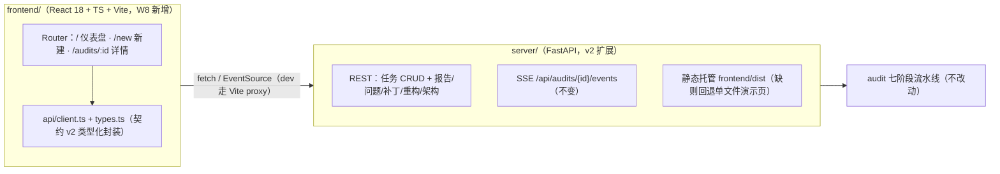

# 13 Wave 8 总体方案：Web 前后端（配套前端升级）

版本：v1.0 ｜ 日期：2026-09-13 ｜ 前置：docs/12（v0.4.0 已发布，1039 测试 + CI/Docs/Release 全绿）

---

## 1. 开源调研结论（GitHub 核实数据，2026-09-13）

| 项目 | Star | 结论 |
|---|---|---|
| [ant-design/ant-design](https://github.com/ant-design/ant-design) | 99.5k★，当日仍在推送 | **采用**：企业级 React 组件库，中文生态第一；Table/Form/Steps/Upload 直接覆盖审计工作台需求 |
| [apache/echarts](https://github.com/apache/echarts) | 67.3k★ | **采用**：健康分 gauge、严重度/类别分布图；直接用 echarts 本体（不引第三方 wrapper） |
| [vitejs/vite](https://github.com/vitejs/vite) 官方 react-ts 模板 | — | **采用**：脚手架起点（React 18 + TS + Vite），不引重型 admin 模板（ant-design-pro 为 UmiJS 栈，过重） |
| [DefectDojo/django-DefectDojo](https://github.com/DefectDojo/django-DefectDojo) | 4.9k★ | **交互范式参考**：漏洞管理仪表盘的「severity 小部件 + 过滤器 + 发现列表 + 详情展开」布局 |
| [ZupIT/horusec](https://github.com/ZupIT/horusec) | 1.3k★ | **对标**：一体化 SAST 平台形态（CLI 为主，web 平台已独立）；确认本项目「引擎 + 轻工作台」定位合理 |
| SonarQube / Semgrep / CodeQL | — | UI 范式参考（问题列表 + 严重度筛选 + 代码定位）；前端闭源/部分闭源，不作代码复用 |

**决策**：不下载现成 admin 模板（体积大、技术栈不合、维护负担），以 Vite 官方模板起步 + antd 5 + echarts 组合，自建约 15 个组件的轻工作台。已有的 `web/index.html` 单文件演示页**保留**为零构建回退入口。

## 2. 总体架构



**技术选型**：React 18 + TypeScript(strict) + Vite 5、antd 5（zhCN locale）、react-router-dom 6、echarts 5（直连，自写 useChart hook）、dayjs；测试 vitest + @testing-library/react（jsdom）。包管理 npm（node 24 / npm 11 已验证，registry 连通）。

**部署形态**：`python cli.py serve` 单进程同时服务 API 与前端产物；开发态 `npm run dev`（5173，proxy /api → 8000）+ uvicorn 双进程。

## 3. REST API 契约 v2.0（在 v1 基础上纯增量，旧端点行为不变）

| 端点 | 方法 | 契约 |
|---|---|---|
| `/api/health` | GET | `{status:"ok", version, audits:{active,total}}` |
| `/api/audits` | GET | `?limit&offset` → `{total, audits:[{audit_id,status,created_at,source_path,do_fix,do_tests,error}]}`；任务表条目新增 `created_at/source_path/do_fix/do_tests` 字段 |
| `/api/audits` | POST | 既有 `{source_path,do_fix,do_tests}` → `{audit_id}`，行为不变 |
| `/api/audits/upload` | POST | multipart 字段 `file`（zip）；校验：非 zip → 400；>200MB → 413；落盘 `<work_root>/uploads/<audit_id>.zip` 后走既有创建流程 → `{audit_id}` |
| `/api/audits/{id}` | GET | 既有 payload 增补 `created_at/source_path/do_fix/do_tests` |
| `/api/audits/{id}` | DELETE | 未知 → 404；终态 → 204 并移除；running → 先 `task.cancel()`（entry 置 failed/error=已取消）再移除 → 204 |
| `/api/audits/{id}/events` | GET | SSE，**不变**（含历史回放与 done 终止帧） |
| `/api/audits/{id}/understand` | GET | `{architecture: ArchitectureCard\|null}`（`report.architecture.to_dict()`，未完成沿用既有 404 语义） |
| `/api/audits/{id}/refactors` | GET | `{total, proposals:[RefactorProposal.to_dict()]}`（契约 v1.7 字段：id/title/target/kind/rationale/steps/benefits/related_issues/source/confidence） |
| `/api/audits/{id}/summary\|issues\|patches\|report` | GET | **不变** |
| `/` 与未知路径 | GET | `frontend/dist/index.html` 存在则 SPA 兜底（catch-all）；否则回退 `web/index.html`；`/assets/*` 挂载 dist 静态资源 |
| CORS | — | 仅放行 `http://localhost:5173` 与 `http://127.0.0.1:5173`（开发态） |

任务列表为**内存态**（进程重启即清空）——0.5.0 如实标注，持久化留作后续 Wave。

## 4. 任务分解表（3 个并行大任务 + 集成人）

| 代号 | 任务名 | 独占目录/文件 | 禁改 |
|---|---|---|---|
| W8-A1 | 后端 API v2 | `server/**`、`tests/unit/server/**` | `cli.py`、`audit/**`、`web/index.html` |
| W8-A2 | 前端基座 | `frontend/` 脚手架、`package.json`（唯一所有者）、`src/{main,App,router,theme,api,layouts,utils}/**`、`src/pages/Dashboard/**`、`src/pages/NewAudit/**`、`src/pages/TaskDetail/index.tsx`（**仅占位**，两行文案即可）、前端 vitest 基建 + 自测 | `src/pages/TaskDetail/` 除 index.tsx 外、`src/components/**` |
| W8-A3 | 任务详情页 | `src/pages/TaskDetail/**`（覆盖 A2 占位）、`src/components/**`、自测文件 | `package.json`、A2 全部文件（缺依赖不许自装，报集成人） |
| W8-A4 | 集成与发布 | `.github/workflows/**`、`bench/**`、`docs/13`、`README.md`、`CHANGELOG.md`、`audit/__init__.py`（版本单源）、`Makefile` | 其余 |

**依赖策略**：`package.json` 由 A2 一次性锁定全部依赖（含 A3 所需：antd、react-router-dom、echarts、dayjs、vitest、@testing-library/*、jsdom）；A3 零包管理操作，避免并行安装冲突。

## 5. 关键设计约束

1. **契约先行**：三个代理以本文档 §3/§6 为唯一契约；`api/types.ts` 类型以后端 `audit/models.py` 为 source of truth（Issue/Patch/RefactorProposal/ArchitectureCard/summary）。
2. **A1 零回归**：旧端点（POST /api/audits、events、report、issues、patches、summary）行为与状态码逐条不变；既有 `tests/unit/server/**` 全绿；ruff 零告警。
3. **A2/A3 解耦**：A3 只 import A2 的 `api/client.ts`、`api/types.ts`、`components/SevTag`（若需）等公共层，公共层接口在 §6 固定；A3 内部状态自管理。
4. **UI 语言**：全站中文（antd ConfigProvider zhCN + dayjs zh-cn）；颜色沿用演示页语义（critical 红 / high 橙 / medium 黄 / low 蓝）。
5. **SSE 消费**：EventSource 优先，onerror 自动降级 1s 轮询 `GET /api/audits/{id}`（沿用演示页已验证模式）；完成后并行拉 summary/patches/issues/refactors/understand。
6. **性能**：问题列表走服务端 severity/category 过滤 + 前端关键词过滤（与现状一致）；表格用 antd Pagination，不做虚拟滚动。
7. **底线**：全量 pytest 零回归（1039+新增）、ruff 零告警、`npm run build` + `tsc --noEmit` + `vitest run` 全绿、demo exit 0。

## 6. 前端公共层契约（A2 产出、A3 消费）

```ts
// src/api/types.ts：AuditSummary、IssueItem、PatchItem、RefactorProposalItem、
//   ArchitectureCard、TaskListItem、CreateAuditResult（字段名与 §3/audit.models 完全一致，camel 不转）
// src/api/client.ts：
export const getHealth(): Promise<HealthInfo>
export const listAudits(limit?, offset?): Promise<{total: number; audits: TaskListItem[]}>
export const createAudit(body: {source_path: string; do_fix: boolean; do_tests: boolean}): Promise<{audit_id: string}>
export const uploadAuditZip(file: File, opts: {do_fix: boolean; do_tests: boolean}): Promise<{audit_id: string}>
export const getAudit(id: string): Promise<AuditDetail>          // status/error/report?/created_at...
export const deleteAudit(id: string): Promise<void>
export const getSummary(id): Promise<AuditSummary>
export const listIssues(id, params?: {severity?; category?; limit?; offset?}): Promise<{total; issues: IssueItem[]}>
export const listPatches(id): Promise<{total; patches: PatchItem[]}>
export const listRefactors(id): Promise<{total; proposals: RefactorProposalItem[]}>
export const getUnderstand(id): Promise<{architecture: ArchitectureCard | null}>
export const reportUrl(id, fmt: "json"|"md"|"html"): string
export const subscribeEvents(id, onEvent, onDone, onError): () => void   // 内建降级轮询
```

路由：`/`（仪表盘）、`/new`（新建）、`/audits/:id`（详情）。TaskDetail 面板结构（A3）：Steps 进度条（运行中）→ 完成后 Tabs【概览｜问题｜修复补丁｜重构方案｜架构理解】+ 报告下载链接组。

## 7. 集成、测试与发布流程（集成人 W8-A4）

三任务合流 → 集成自检（全量 pytest + ruff + build + vitest）→ **联调**（uvicorn + 构建产物，demo/mini_app 全链路：新建→SSE 进度→仪表盘→问题→补丁→重构方案）+ 浏览器黑盒 GUI 测试 + 视觉验收截图 → **压测**（`bench/stress_web.py`：并发创建+轮询、读端点突发、SSE 并发流；出 `bench/results/stress_w8.md`）→ 修复 → README/CHANGELOG/版本 0.5.0 → tag **v0.5.0** → Release。

## 8. 发布记录（W8-A4，v0.5.0）

2026-09-13 发布 0.5.0。开发执行情况与契约偏差如实记录：

### 8.1 任务完成情况

| 代号 | 交付 | 自验结果 |
|---|---|---|
| W8-A1 后端 API v2 | §3 契约全部端点 + SPA 托管 + CORS；`tests/unit/server` 26→47 条 | 全量 pytest 1039→1060 全绿，ruff 零告警；移交事项 `python-multipart` 入 pyproject（集成人落地） |
| W8-A2 前端基座 | Vite+React18+TS 脚手架、API 公共层（含 SSE 降级轮询）、Dashboard、NewAudit、SevTag/StatusTag | typecheck + vitest 23 条 + build 全绿 |
| W8-A3 任务详情页 | **代理因账户限流中断于 8/12 文件**，集成人按其已落文件的风格与接口接手收尾：PatchesPanel / RefactorsPanel / UnderstandPanel / index.tsx 组装 / 22 条测试 | vitest 全量 45 条全绿，typecheck/build 通过 |
| W8-A4 集成发布 | 契约文档、依赖收口、CI 前端 job、README/CHANGELOG/Makefile、联调、GUI 黑盒、压测、5 项修复、版本 0.5.0 | 见下 |

### 8.2 联调与 GUI 黑盒测试（T1–T6 全过）

浏览器黑盒全链路：仪表盘空态→新建审计（本地路径）→SSE 七阶段进度→自动切换概览（健康分 gauge / 严重度柱状图 / 徽章 / 元信息）→问题列表（服务端 severity 过滤 3→1、行展开详情）→修复补丁/重构方案空态→架构卡片渲染→错误路径（不存在路径，后端 400 以 message 透出）→删除任务（统计与列表同步刷新）。SPA 托管与客户端路由兜底（`/audits/xyz` → index.html）实证。

**发现并修复 5 项**：
1. **[P1] 报告下载链接 404**：`GET /summary` 返回流水线报告内部 `audit_id`，与服务端任务 ID 是两个体系，前端按其拼链接必 404 → 后端 summary 以任务表键为准（一处修复两端受益）。
2. **[P2] 严重度下拉文案重复**（"critical critical"）：IssuesPanel 错用类别标签映射 → 改用 SEV_LABEL（"致命 critical"）。
3. **[P1→瞬态] 仪表盘统计自相矛盾**（总任务 0 vs 已完成 2，judge 视觉验收发现）：总任务数与任务列表分两段异步 setState，中间态可见 → 总任务改为与表格同源同批更新（`list.total`），顺带省一次 health 请求。
4. **[P3] 详情页标题双 ID 冗余** → 移除短 ID。
5. **[P3] html/body 无底色**，滚动合成露黑 → 全局兜底 `#f5f5f5`。

**判定为测试环境伪影（不修）**：Tab 激活指示条一次未跟随——面板后台化后 requestAnimationFrame 被节流所致（React 状态与内容切换正常，前台会话同路径正常）；重启面板后无法复现。

### 8.3 压测基线（bench/results/stress_web_w8.md，正式口径）

| 场景 | 结果 |
|---|---|
| S1 读端点突发 | 32 并发 × 560 请求，**309.7 RPS，p95=119.5ms，0 错误** |
| S2 并发审计 | 6 任务同时提交全 done、ID 互异，端到端 p50=14.2s（80 文件合成项目离线口径），吞吐 25.4 任务/min |
| S3 SSE 并发流 | 24 并发连接全部收到 done 终帧，首事件 p50=97.5ms |
| S4 zip 上传 | 12 次 p50=377ms，非 zip 负样本正确 400 |

### 8.4 最终质量门

- 全量 pytest **1060 passed**（基线 1039 + W8 新增 21 后端 + 版本门更新），ruff 零告警
- 前端：tsc --noEmit 零错误，vitest **45 passed**（A2 23 + A3 22），vite build 成功
- CI 新增 `frontend` job（node 20：typecheck + vitest + build），与 Python 三矩阵并行
- 已知诚实边界：任务列表为内存态（重启即清空，UI 有对应提示文案）；上传采用读入内存后校验（200MB 上限在读取后判定）；upload 大文件防护的流式化、任务持久化留作后续 Wave。
